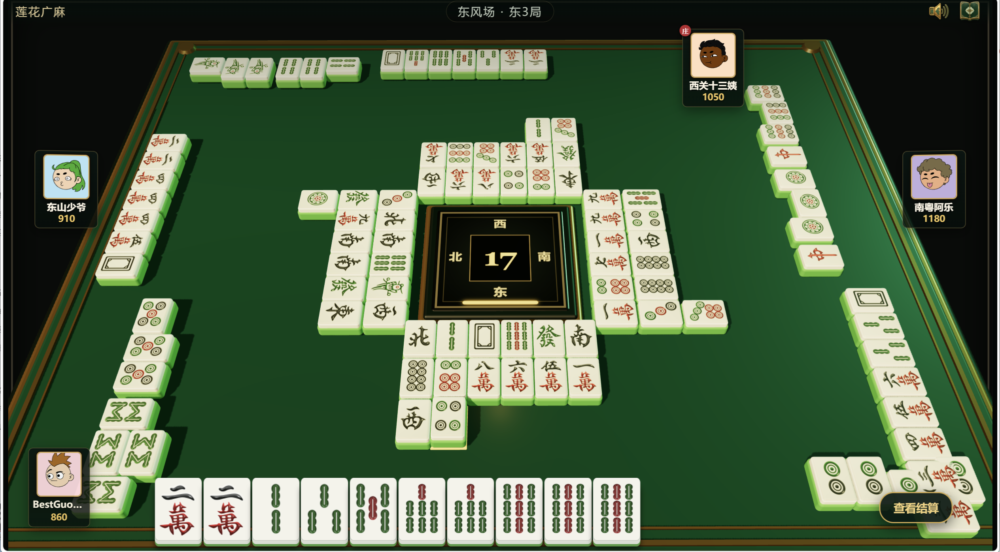

# 莲花广麻

[](https://github.com/BestGuo2020/lianhuaguangdongmahjong/stargazers)
[](./LICENSE)


一款使用 Vue 3 和 Three.js 实现的单机四人麻将游戏，视觉风格参考传统 PC 麻将房。玩家坐在本家位置与三名本地 AI 对局，可选择东风场或半庄场；项目不包含服务端、账号系统或联网对战。

> 玩法按作者第一次接触的莲花广麻规则实现，部分计分细节可能与其他地区或牌馆的规则存在差异。实际行为以本项目代码和游戏内“玩法”面板为准。

## 游戏截图



## 技术栈

| 分类 | 技术 |
| --- | --- |
| 前端框架 | Vue 3（Composition API、单文件组件） |
| 开发语言 | TypeScript |
| 3D 渲染 | Three.js |
| 构建工具 | Vite 8 |
| 类型检查 | vue-tsc |
| 测试 | Vitest |
| 包管理 | npm（仓库包含 `package-lock.json`） |

项目为纯前端单页应用。`package.json` 已通过 `engines` 声明运行环境：Node.js `^20.19.0 || >=22.12.0`，npm `>=9.0.0`。

## 功能概览

- 单机四人对局：一名玩家与三名本地 AI。
- 东风场（4 局）和半庄场（8 局）两种模式。
- 3D 麻将桌、牌墙、手牌、副露与弃牌展示。
- 发牌、掷骰、摸打、碰、明杠、暗杠、补杠、自摸及抢杠胡流程。
- 听牌提示、待牌剩余数量、回合倒计时、积分变化与局末排名。
- 触屏移动设备竖屏时提示切换横屏，并尝试进入横屏全屏模式。
- 牌型判断、计分、牌桌布局、比赛推进和胡牌演出等自动化测试。

### 当前实现的主要规则

- 只碰、杠，不吃牌。
- 仅支持自摸与抢杠胡，不支持普通弃牌点炮。
- 白板作为癞子，可替代对子、刻子或顺子所需的牌。
- 底分为 100；庄家胡牌 ×2，无白板胡牌 ×2，四张红中胡牌额外 ×4。
- 摸到红中会立即亮杠，并从牌墙尾部补摸；累计四张红中立即按自摸结算。
- 胡牌后从牌墙摸最多 8 张马牌；1、5、9 和红中为中马，每张增加一份底分。
- 暗杠由其余三家各支付 2 份底分；明杠由出牌者支付 1 份底分；补杠由其余三家各支付 1 份底分。
- 抢杠胡只由被抢杠者支付胡牌分数。
- 胡牌单家支付额：`底分 × 倍数 + 中马数 × 底分`。

## 安装方式

### 前置条件

- Node.js `^20.19.0 || >=22.12.0`
- npm `>=9.0.0`

克隆或下载项目后，在仓库根目录安装锁定版本的依赖：

```bash
npm ci
```

如果正在主动更新依赖，可使用 `npm install`；普通开发和 CI 环境优先使用 `npm ci`，以保持与 `package-lock.json` 一致。

## 本地运行

启动开发服务器：

```bash
npm run dev
```

Vite 配置的默认端口为 `4173`，开发服务器监听 `0.0.0.0`。通常可在浏览器打开：

```text
http://localhost:4173
```

终端输出的地址应作为最终依据。如果端口已被占用，Vite 可能选择其他可用端口。

进入大厅后选择“东风场”或“半庄场”并开始游戏。移动端建议横屏使用；部分浏览器不允许网页自动锁定方向，此时请手动横置设备。

## 常用命令

| 命令 | 作用 |
| --- | --- |
| `npm run dev` | 启动 Vite 开发服务器，监听所有网络接口 |
| `npm run typecheck` | 使用 `vue-tsc` 执行 TypeScript 类型检查，不生成文件 |
| `npm test` | 使用 Vitest 单次运行全部测试 |
| `npm run build` | 先执行类型检查，再生成生产构建 |
| `npm run preview` | 在本地预览生产构建，监听所有网络接口 |

推荐在提交变更前至少运行：

```bash
npm test
npm run build
```

## 环境变量

当前项目中未发现 `.env`、`.env.example` 或业务自定义环境变量说明，也没有必须配置的环境变量。

代码通过 Vite 内置的 `import.meta.env.BASE_URL` 拼接音频、图片和头像资源路径。若以后新增客户端环境变量，请遵循 Vite 的 `VITE_` 前缀约定，并同步提供不含敏感值的 `.env.example`。不要把密钥放入前端环境变量或提交到仓库。

## 目录结构

```text
.
├─ public/                  # 构建时原样复制的静态资源
│  ├─ audio/               # 背景音乐、操作和牌面语音
│  ├─ avatars/             # 玩家头像
│  ├─ img/                 # 界面图标
│  └─ tiles/               # 麻将牌面图片
├─ src/
│  ├─ components/
│  │  ├─ MahjongTable3D.vue # Three.js 牌桌与 3D 场景
│  │  ├─ MahjongTile.vue    # 2D 麻将牌组件
│  │  ├─ PlayerSeat.vue     # 玩家座位与状态展示
│  │  └─ RulesPanel.vue     # 游戏内玩法说明面板
│  ├─ game/
│  │  ├─ useGame.ts         # 对局状态、回合流程和玩家/AI 操作
│  │  ├─ rules.ts           # 胡牌判断、杠分、胡牌计分与买马
│  │  ├─ tiles.ts           # 牌集合、牌墙、排序和牌名工具
│  │  ├─ tableLayout.ts     # 牌桌布局计算
│  │  ├─ winEffect.ts       # 胡牌展示布局与动效时序
│  │  ├─ useAudio.ts        # 背景音乐和音效管理
│  │  ├─ types.ts           # 游戏领域类型
│  │  └─ *.test.ts          # Vitest 单元与流程测试
│  ├─ App.vue               # 应用界面、交互入口和响应式适配
│  ├─ main.ts               # Vue 应用入口
│  ├─ style.css             # 全局样式
│  └─ env.d.ts              # Vite 类型声明
├─ docs/                    # 项目参考图片
├─ index.html               # Vite HTML 入口
├─ vite.config.ts           # Vite 与开发服务器配置
├─ tsconfig.json            # TypeScript 配置
├─ package.json             # 依赖与 npm 脚本
└─ package-lock.json        # npm 依赖锁文件
```

`dist/`、`node_modules/`、`tmp/` 和本地日志属于生成物或本地工作文件，不应作为业务源码维护。

## 开发规范

- 使用 Vue 单文件组件和 `<script setup lang="ts">`；可复用的游戏逻辑放在 `src/game/`，展示逻辑放在 `src/components/`。
- 保持现有代码风格：2 空格缩进、单引号、通常不写行末分号。
- 共享的牌、玩家、动作和结算结构应在 `src/game/types.ts` 中定义，避免在组件内重复声明。
- 修改规则时同时检查 `rules.ts`、`useGame.ts`、游戏内 `RulesPanel.vue` 与本 README，确保实现和说明一致。
- 修改牌桌位置或胡牌演出时，优先更新相应的纯函数，并补充或调整测试。
- 静态资源放入 `public/` 对应子目录，运行时代码使用 `import.meta.env.BASE_URL` 构建 URL，以避免硬编码站点根路径。
- 不直接编辑 `dist/`；生产文件必须由构建命令重新生成。
- 当前项目中未发现 ESLint、Prettier、提交信息规范或贡献流程说明。

## 构建和部署

生成生产版本：

```bash
npm run build
```

该命令会先运行类型检查，再由 Vite 将静态文件输出到 `dist/`。本地检查构建结果：

```bash
npm run preview
```

部署时将 `dist/` 的内容交给能够托管静态站点的 Web 服务器即可。当前项目中未发现指定的部署平台、CI/CD 配置、容器配置或服务器端服务说明。

当前 `vite.config.ts` 未设置自定义 `base`，默认按站点根路径构建。如果部署到域名的子路径，需要先根据目标环境配置 Vite 的 `base`，并确认 `public/` 下的音频、图片和头像均能正确加载。应用当前没有前端路由，因此不需要额外配置 SPA 路由回退。

## 常见问题

### `npm ci` 提示 Node.js 版本不兼容

请确认 `node --version` 满足 `^20.19.0 || >=22.12.0`，并确认 `npm --version` 不低于 `9.0.0`。Node.js 21、低于 22.12.0 的 Node.js 22，以及低于 20.19.0 的 Node.js 20 均不在当前约束范围内。升级运行环境后重新执行 `npm ci`。

### `4173` 端口无法访问

先查看 `npm run dev` 的终端输出，确认 Vite 实际使用的端口。若从同一局域网的其他设备访问，还需使用开发机的局域网 IP，并确认系统防火墙允许该端口。

### 页面有画面但没有声音

浏览器通常要求用户先进行一次交互才能播放音频。请点击开始游戏，并确认界面未静音、浏览器标签页未静音，且 `public/audio/` 中的资源可以正常访问。

### 手机一直提示切换横屏

游戏在触屏、小尺寸且竖屏的设备上启用横屏提示。点击提示可尝试进入横屏全屏；若浏览器不支持方向锁定，请手动旋转设备，或更换支持相关 Fullscreen/Screen Orientation API 的浏览器。

### 构建后静态资源返回 404

如果站点部署在子路径而不是域名根路径，请配置 Vite 的 `base` 后重新构建。不要直接修改 `dist/` 中生成的 URL。

### 修改规则后测试失败

规则测试位于 `src/game/*.test.ts`。确认规则实现、对局流程、计分预期和玩法文案都已同步更新，然后重新运行 `npm test` 和 `npm run build`。

## 资源说明

示例头像由 [DiceBear Adventurer](https://www.dicebear.com/styles/adventurer/) 生成，原始设计作者为 Lisa Wischofsky，采用 CC BY 4.0 许可。

项目代码许可见 [LICENSE](./LICENSE)。
