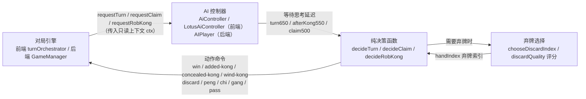
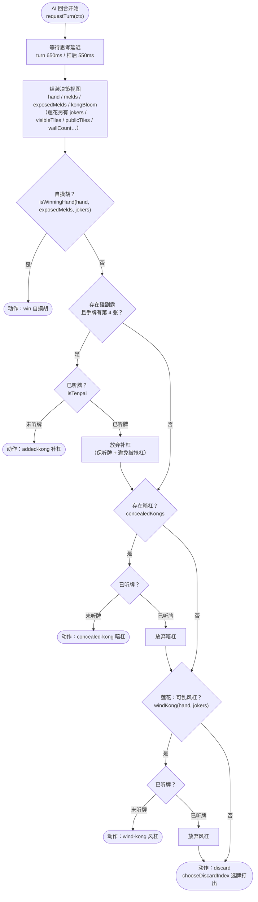
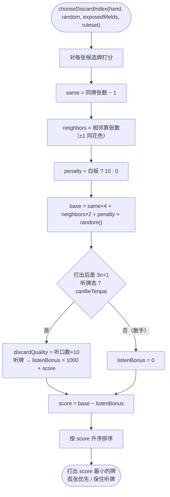
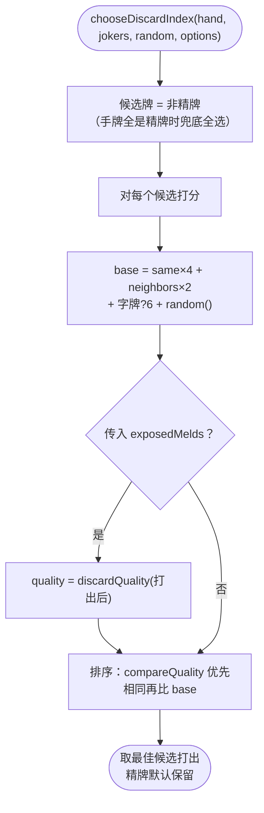
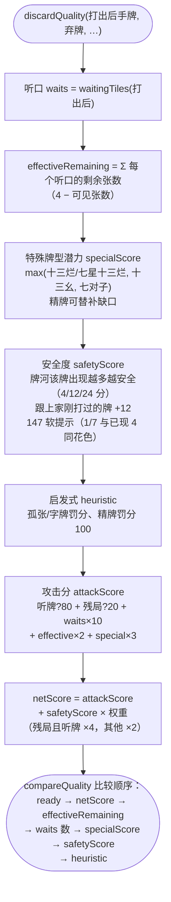
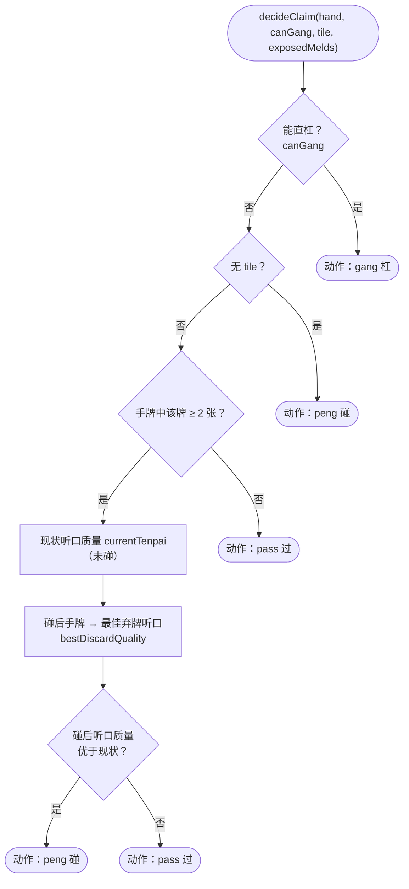
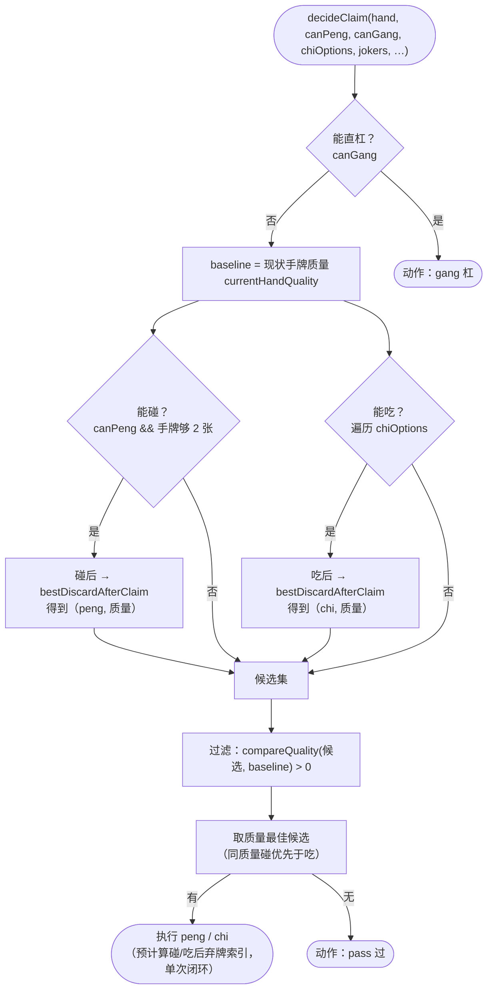
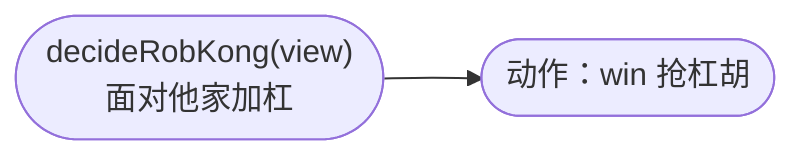

# AI 出牌逻辑流程图

> 本文档基于 codegraph 对现有代码的分析，用流程图梳理本项目（莲花广麻）的 AI 出牌逻辑。
> 所有图均为 Mermaid 语法，可在 GitHub / VS Code（安装 Markdown Preview Mermaid Support）等环境中直接渲染；
> 浏览器直接查看请打开同目录的 `ai-play-flowchart.html`。

## 0. 代码位置总览

本项目存在 **两套麻将变体**，每套都有 **前端（TypeScript）** 与 **后端（Python）** 两套实现，逻辑互为翻译：

| 变体                   | 前端控制器                                                              | 前端决策层（纯函数）                                                                                           | 后端控制器                                         | 后端决策层                                   |
| -------------------- | ------------------------------------------------------------------ | ---------------------------------------------------------------------------------------------------- | --------------------------------------------- | --------------------------------------- |
| 经典广麻 `lotus-classic` | `AiControllersrc/game/core/controllers/playerController.ts:267`    | `decideTurn` / `decideClaim` / `decideRobKong` / `chooseDiscardIndexsrc/game/core/controllers/ai.ts` | `AIPlayerbackend/app/game/player.py:108`      | `decide_turn` 等`backend/app/core/ai.py` |
| 莲花麻将 `lotus-legacy`  | `LotusAiControllersrc/game/variants/lotus/lotusControllers.ts:318` | 同名函数`src/game/variants/lotus/lotusAi.ts`                                                             | `AIPlayer`（`rules.code == 'lotus-legacy'` 分支） | `lotus_ai.py`                           |

设计原则（两端一致）：**决策与执行分离** —— 决策层是纯函数，只做「看状态 → 给动作命令」，不改任何状态、不触发表现副作用，可独立单元测试；动作的执行由引擎（前端 `useGame` / 后端 `GameManager`）完成。

**思考延迟**（前端 `playerController.ts:80` / `lotusControllers.ts:144`，后端 `player.py:91` 完全对齐）：

| 场景                  | 延迟                |
| ------------------- | ----------------- |
| 摸牌后出牌 `turn`        | 650 ms            |
| 杠后补摸再决策 `afterKong` | 550 ms            |
| 吃碰杠响应 `claim`       | 500 ms            |
| 抢杠 `requestRobKong` | 无额外延迟（引擎层面已 pace） |

## 1. 总体架构

## 2. 回合出牌决策 `decideTurn`（核心流程图）

优先级链：**自摸胡 → 补杠 → 暗杠 →（莲花：乱风杠）→ 弃牌**。
杠前都会做 `isTenpai`（是否已听牌）评估：已听牌时放弃杠，避免拆散成形手牌、暴露第 4 张被抢杠。

**莲花补杠特例**（`shouldTakeAddedKong`，`lotusAi.ts:111`）：牌河（publicTiles）中该牌已出现过 1 张以上时直接补杠（别家听它的概率低）；否则才用 `isTenpai` 判断。经典版无此特例，只看 `isTenpai`。

## 3. 弃牌选择 `chooseDiscardIndex`

### 3.1 经典广麻（`ai.ts:180`）

目标：优先打出「孤张」（同牌少、无相邻靠张的牌），白板（癞子）加罚分保手；若打出某张后能听牌，则重奖保留。

### 3.2 莲花麻将（`lotusAi.ts:463`）

精牌默认保留（只有手牌全是精牌时才兜底打出）；有 `exposedMelds` 时叠加 `discardQuality` 综合评分排序（见第 4 节）。

## 4. 莲花弃牌综合评分 `discardQuality`（`lotusAi.ts:298`）

莲花 AI 的弃牌质量 = **进攻（听口/特殊牌型） + 防守（安全度）** 的加权组合：

要点：

- **残局（wallCount ≤ 8）** 未听牌时更看重听口（冲牌），攻击分整体上调。
- **特殊牌型潜力**：`specialPatternScore` 只在无副露（exposedMelds = 0）时计算，有副露直接 −20；在十三烂 / 十三幺 / 七对子三个方向取最大。
- **安全度只依赖公开信息**（牌河 + 公开副露 + 上家弃牌），不读别家手牌。

## 5. 副露决策 `decideClaim`（面对他家弃牌：吃碰杠）

### 5.1 经典广麻（`ai.ts:118`）

能杠必杠；碰需评估「碰后听口质量」是否优于现状，不提升则 pass（广麻无点炮，防守价值低）。

### 5.2 莲花麻将（`lotusAi.ts:130`）

能杠必杠（杠后从牌尾补牌，无法凭当前 13 张准确预判听口，故杠保持最高优先级）；碰与吃必须与现状比较听牌质量，并支持**吃**（经典版不支持吃）。

**两端一致的安全守卫**：碰后手牌恰好为空（只剩 2 张被碰走）时真实规则下不能碰，返回 `pass`，否则出牌阶段空手会让对局停滞（前端 `playerController.ts:316`，后端 `player.py:153`）。

## 6. 抢杠决策 `decideRobKong`

最简单的一环：**能抢必抢**，无风险权衡（两端一致，预留未来按听牌风险返回 `pass` 的扩展点）。

## 7. 前后端对应关系

| 前端（TS）                                        | 后端（Python）                                                        |
| --------------------------------------------- | ----------------------------------------------------------------- |
| `AiController` / `LotusAiController`          | `AIPlayer`（`player.py`）                                           |
| `decideTurn`（`ai.ts` / `lotusAi.ts`）          | `decide_turn`（`core/ai.py:27`，lotus-legacy 转发 `core/lotus_ai.py`） |
| `decideClaim`                                 | `AIPlayer.request_claim`（含 `_request_lotus_claim`）                |
| `decideRobKong`                               | `decide_rob_kong`                                                 |
| `chooseDiscardIndex` + `discardQuality`       | `choose_discard_index` / `lotus_ai.py` 对应函数                       |
| `AI_DELAYS` / `LOTUS_AI_DELAYS` = 650/550/500 | `AI_DELAYS` = 650/550/500（`player.py:91`）                         |

> 注意：**在线联机模式**下 AI 由后端 `AIPlayer` 驱动（前端只渲染结果），本地单机模式由前端 `AiController` 驱动；两套逻辑保持一致。

