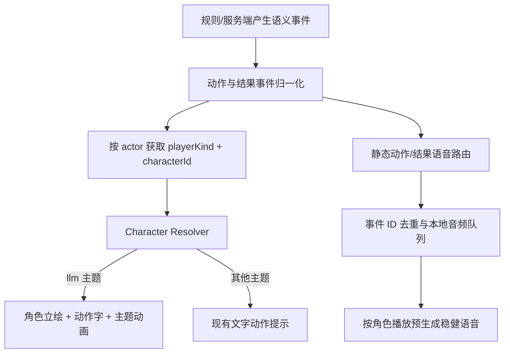

# 独立大模型二次元主题实施计划

> 状态：方案草案，基于 2026-08-30 的前端、后端与素材只读审计。本文只规划实施，不代表功能已经完成。

## 1. 目标

保留现有 `llm` 深蓝星轨主题及其行为，新增独立的 `llmAnime` 大模型二次元主题。默认、雀魂、欢乐麻将、红木和现有深蓝星轨主题的视觉、布局、游戏逻辑与声音行为均不被新主题替换。

本期目标包括：

- 新 `llmAnime` 主题专属字体、牌面、牌背、广播提示、气泡框、局结算和最终结算视觉。
- 吃、碰、杠、胡、自摸、抢杠胡使用“角色立绘 + 动作大字 + 特效”的卡通演出。
- 角色形象与 LLM 供应商、决策风格解耦。
- `llmAnime` 主题下，非 LLM 座位未指定角色时统一回退 DeepSeek 形象。
- 单机本家可选择角色；WebSocket 多人联机真人可选择角色，并让房内其他客户端看到一致结果。
- 吃、碰、杠、胡、自摸、抢杠胡使用预生成的本地固定语音，音色配置按“稳健”生成，运行时不请求 LLM 或在线 TTS。
- 真人出牌只保留实体落牌声，不报牌名、不进入 TTS。
- 胜、负、流局发言改为角色对应的本地固定发言；赢家先说，其余座位顺时针依次说。

## 2. 本期冻结的产品决策

### 2.1 视觉方案

首版采用分层演出，不制作 12 个角色各 6 套独立动作姿势：

1. 每个角色准备一张透明半身/立绘。
2. 六类动作使用公共的大字、描边、光效和粒子层。
3. 根据行动座位调整人物朝向、裁切、入场方向和动作字位置。
4. 未来如要增加独立表情或姿势，可在角色 manifest 中增加可选动作覆盖图，不改变事件协议。

这一方案可以达到参考图中“角色 + 大动作字”的主要效果，同时把素材需求从最多 72 张动作立绘降到 12 张角色立绘加 6 套公共字效。

### 2.2 角色与模型解耦

- `characterId` 只控制角色视觉和固定声音。
- `providerId`、`model`、`style`、API Key 只控制 LLM 决策与普通吐槽。
- 真人选择角色不会使其变成 LLM。
- LLM 座位优先由供应商映射角色；映射失败回退 `deepseek`。
- 普通 AI、旧协议玩家、非法或缺失角色统一回退 `deepseek`。
- 禁止客户端提交任意图片 URL 或文件路径，只接受角色白名单 ID。

### 2.3 声音方案

“预设语音”按静态音频解释：离线使用角色 voice key 和“稳健”风格生成、审核后提交 MP3，运行时只播放本地文件。

- 动作语音：`chi`、`peng`、`gang`、`hu`、`zimo`、`qiangganghu`。
- 结果语音：`win-self-draw`、`win-discard`、`win-robbed-kong`、`loss`、`draw`。
- 每个角色首版共 11 个固定语音，12 个角色共 132 个音频文件。
- 角色普通出牌吐槽仍可保留现有 LLM 动态气泡/TTS，但动作和赛后发言不得再进入动态 TTS。
- 在 `llmAnime` 主题下，真人不进入普通 LLM 吐槽或牌名播报链路；其他主题（包括现有 `llm`）保持当前牌名播报与动态 TTS 行为。
- 所有实体音效，例如落牌、牌面落位、胡牌特效，继续保留，但必须防止与固定人声重复播放。
- `<角色>/<事件>` 静态语音缺失时回退 DeepSeek 同事件；DeepSeek 仍缺失时静音并只保留非人声音效，绝不回退动态 TTS。

### 2.4 主题边界

- 新主题 ID 固定为 `llmAnime`，主题选项文案为“大模型二次元”；内部资源目录仍使用 `llm-anime`，二者不要混用。
- 现有 `llm` 主题继续使用 `llmTheme`、`llm-table.webp` 和“大模型专属/深蓝星轨”选项，不修改或重命名。
- 当前“启用 LLM 且未明确选主题”的自动推荐继续选择现有 `llm` 深蓝星轨主题；`llmAnime` 首版只由用户明确选择，URL 为 `?theme=llmAnime`。
- 二次元视觉、真人禁报牌、真人赛后角色发言只在 `themeName === 'llmAnime'` 时生效。
- 角色 ID 始终随玩家身份保存和同步，即使当前客户端没有使用 `llmAnime` 主题；这样其他使用该主题的客户端仍能正确显示角色。
- 动作/赛后动态 TTS 必须携带明确的 `purpose/actionKind`；目标态服务端不为声明 `anime-static-v1` 的连接合成或投递这两类音频，但继续为现有主题/旧客户端的 legacy 连接保留原行为。
- `llmAnime` 客户端的动作/赛后人声走本地静态包；其他主题和旧客户端继续走现有动态/legacy 路径，具体通过连接级能力协商实现，见 §8。

## 3. 当前状态与主要缺口

| 范围 | 当前实现 | 缺口 |
|---|---|---|
| 现有深蓝主题 | `App.vue` 设置 `data-table-theme="llm"`，3D 牌桌读取 `llmTheme` | 必须原样保留，并补视觉/声音回归测试 |
| 新二次元主题 | 当前不存在 `llmAnime` 主题 ID 或 registry 项 | 需新增独立主题、manifest、选择项和 URL 解析 |
| 桌面 | 现有 `public/img/llm-table.webp` 是深蓝星轨主题桌布 | 原图继续只服务 `llm`；`llmAnime` 使用独立 `table/surface.webp` |
| 字体 | 系统微软雅黑/苹方，部分位置声明未打包的 `Noto Serif SC` | 无仓库内字体和许可证 |
| 2D 牌面 | `tileAssets.ts` 固定读取 `public/tiles/` | 缓存没有主题维度，无法切换牌面 |
| 3D 牌面 | 与 2D 共用同一套牌图并生成 atlas | `llmTheme` 明确继承默认牌面 |
| 牌背 | 2D CSS 绿色渐变；3D Canvas 三色渐变 | 无图片牌背，2D/3D 需统一 |
| 广播 | `GameTableHud.vue` 纯文字条 | `llm` 无专属结构或边框资源 |
| 动作提示 | `table-action-cue` 圆形光效 + 文字 | 无角色、无动作图片、无资源回退 |
| 气泡 | `PlayerSeat.vue` 只覆盖三家对手 | 本家没有气泡节点；主题仅换颜色 |
| 结算 | `SettlementOverlay.vue` 共用版式 | `llm` 只换深蓝渐变，没有二次元布局 |
| 身份 | `GamePlayer` 只有 `avatar`、`isLlm?` | 缺 `characterId` 和明确的 `playerKind` |
| 单机本家 | seat 0 固定 `lotus.svg` | 没有本家角色偏好和 seed 接口 |
| 联机真人 | join 只传 nickname/playerId | 前后端协议没有角色字段 |
| 真人出牌 | 所有非 LLM 座位都会播牌名 | 与真人禁报牌需求冲突 |
| 吃碰杠 | LLM 屏蔽通用音效并改走模型台词 TTS | 与固定“稳健”动作语音冲突 |
| 赛后发言 | 只注册 LLM 座位，文字本地但音频运行时合成 | 真人无发言，且仍依赖 TTS 服务 |

## 4. 素材审计与资产合同

### 4.1 已有角色源图

源目录：`tmp/video/大模型二次元形象/`

共有 12 个角色：

`claude`、`deepseek`、`doubao`、`gemini`、`glm`、`gpt`、`grok`、`kimi`、`minimax`、`mistral`、`muse`、`qwen`。

已知问题：

- 目录共 14 个文件，约 8.75 MiB：12 张 JPEG（约 7.02 MiB）和 2 张 DeepSeek cutout PNG（约 1.73 MiB）。
- 12 张 JPEG 中，10 张为 1536×2752，`glm` 为 576×1024。
- DeepSeek JPEG 实际为 750×1344，文件名中的尺寸不准确。
- 只有 DeepSeek 有透明 cutout；`cutout-v2` 错误抠除了大量白色衣裙和头饰，必须弃用。
- 其余 11 位仍是白底 JPEG，需要逐张抠图并在深色、浅色、棋盘格背景上人工检查。
- 现有 `public/img/llm/` 有 11×4=44 张策略头像，均为 512×512，总计约 15.75 MiB；PNG 容器实际为 RGB、没有 alpha，且缺少 Mistral。
- 现有牌面只有 `public/tiles/` 的 34 张 75×100 RGBA PNG，总计约 0.43 MiB。
- 现有桌布 `public/img/llm-table.webp` 为 1024×1024 VP8L lossless，约 1.05 MiB。
- 代码目前只一等识别 DeepSeek、Kimi、Qwen、Doubao、MiniMax、GPT、GLM、Claude 八家；Gemini、Grok、Muse 只能手填 `avatarFolder`，Mistral 没有线上头像、provider 或 TTS 映射，`custom` 目录也不存在。
- 当前不存在专属字体、主题牌面、图片牌背或六动作图片。
- 已有通用吃、碰、杠、胡、自摸语音，但它们不是 12 角色固定语音；没有独立抢杠胡语音。

`tmp/` 被忽略，不能成为可重复构建的唯一真源。Wave 0 必须把批准使用的原图和可用 DeepSeek cutout 移到受版本管理的 `assets-src/llm-anime/`；若版权或仓库体积不允许提交原图，则必须使用外部只读归档并在源 manifest 中记录 URL、SHA256、字节数和恢复步骤。`cutout-v2` 写入拒绝清单，不能被流水线误选。

### 4.2 源文件与运行时目录

```text
assets-src/llm-anime/
  manifest.json
  SOURCES.json
  characters/<id>/source.jpg
  characters/<id>/portrait-master.png
  rejected/deepseek-cutout-v2.png

src/assets/fonts/llm-anime/
  ui.woff2
  display.woff2
  LICENSES.md

public/themes/llm-anime/<assetVersion>/
  characters/
    deepseek/
      portrait.webp
      avatar.webp
      thumb.webp
      audio/
        chi.mp3
        peng.mp3
        gang.mp3
        hu.mp3
        zimo.mp3
        qiangganghu.mp3
        win-self-draw.mp3
        win-discard.mp3
        win-robbed-kong.mp3
        loss.mp3
        draw.mp3
    ...
  actions/
    chi.svg
    peng.svg
    gang.svg
    hu.svg
    zimo.svg
    qiangganghu.svg
  tiles/
    faces/
      1m.webp ... 9m.webp
      1p.webp ... 9p.webp
      1s.webp ... 9s.webp
      1z.webp ... 7z.webp
    back.webp
  table/
    surface.webp
  ui/
    broadcast-frame.svg
    bubble-frame.svg
    bubble-tail.svg
    settlement-bg.webp
    settlement-frame.svg
```

字体放入 `src/assets`，由 Vite 重写为子路径安全的构建 URL；`@font-face` 全局声明，但只在 `llmAnime` 主题 selector 中应用。图片和音频保留在 `public`，所有 URL 通过生成的 TypeScript manifest 使用 `import.meta.env.BASE_URL` 解析。

### 4.3 主题 manifest

`assets-src/llm-anime/manifest.json` 是可编辑的唯一真源；构建脚本生成 `src/game/core/presentation/llmAnimeThemeManifest.generated.ts`，业务代码不得手写第二份路径表。

```ts
export type CharacterId =
  | 'claude' | 'deepseek' | 'doubao' | 'gemini'
  | 'glm' | 'gpt' | 'grok' | 'kimi'
  | 'minimax' | 'mistral' | 'muse' | 'qwen'

export type AnimeVoiceKey =
  | 'chi' | 'peng' | 'gang' | 'hu' | 'zimo' | 'qiangganghu'
  | 'win-self-draw' | 'win-discard' | 'win-robbed-kong'
  | 'loss' | 'draw'

export interface CharacterProfile {
  id: CharacterId
  label: string
  providerAliases: string[]
  portraitUrl: string
  avatarUrl: string
  thumbUrl: string
  audio: Record<AnimeVoiceKey, string>
  voiceKey: string
  accentColor: string
  objectPosition?: string
  actionScale?: number
}

export interface LlmAnimeThemeManifest {
  schemaVersion: 1
  assetVersion: string
  defaultCharacter: 'deepseek'
  fonts: { ui: string; display: string }
  table: { surface: string }
  actions: Record<AnimeActionKey, string>
  tiles: {
    back: string
    faces: Record<TileType, string>
  }
  ui: {
    broadcastFrame: string
    bubbleFrame: string
    bubbleTail: string
    settlementBackground: string
    settlementFrame: string
  }
  characters: readonly CharacterProfile[]
}
```

生成器必须保证根 manifest 中恰有 12 条唯一角色记录、DeepSeek fallback 自身完整、provider alias 不冲突、34 个 TileType 显式列全、11 个 `AnimeVoiceKey` 显式列全、所有被引用文件存在，并拒绝未引用的派生文件。禁止依赖目录扫描或字典序推断牌面。后端维护相同版本的安全 ID/alias catalog，并用 contract 测试校验集合一致，不拼接客户端传入的任意路径。

`assetVersion` 与 schema 版本分离。所有 public 资源位于带版本的目录，或由生成器使用内容哈希文件名；部署可以对这些 URL 使用 immutable 长缓存。校验器必须验证 manifest 引用的版本/哈希与实际文件一致，资源变化必须改变 URL，不能用固定 `portrait.webp` URL 配长期缓存。

### 4.4 冻结的派生规格

| 资产 | 规格 |
|---|---|
| 角色 master | 1024×1536 RGBA PNG；保留完整主体和安全边距 |
| 运行时立绘 | 768×1152 transparent WebP；高质量有损编码，单张不超过 300 KiB |
| 头像 | 512×512 WebP；如用于叠加必须有 alpha，单张不超过 60 KiB |
| 选择器缩略图 | 192×256 WebP，单张不超过 35 KiB，打开选择器后懒加载 |
| 牌面 master | 384×512 RGBA；运行时至少 192×256 WebP，34 张逐键映射 |
| 牌背 | 512×704 WebP，2D/3D 共用设计 |
| SVG 字效/UI | 固定 viewBox，文字转路径；禁止脚本、外链、外部字体和远程图片 |
| 动作音频 | MP3，24 kHz、mono、CBR 64 kbps；0.35–1.2 秒 |
| 结果音频 | MP3，24 kHz、mono、CBR 64 kbps；0.8–1.8 秒 |
| 音频响度 | integrated -16 LUFS ±1，峰值不高于 -1 dBFS；头部静音≤80 ms、尾部≤120 ms |

两款 WOFF2 必须带可再分发许可证，使用 `font-display: swap`，并覆盖动作字、广播、结算、按钮、数字、标点及实际文案所需的中文 glyph；字体 404 或加载慢不得阻塞首屏，必须保留系统字体回退。

Wave 0 先用 DeepSeek、Claude、Kimi 三张做编码基准，冻结 WebP 编码参数、SSIM/视觉阈值和 alpha 质量。若 300 KiB 在三张基准上无法稳定达标，则以“四座立绘总计不超过 2 MiB”为硬闸门并按实测上调单图预算，不得同时强制无损、300 KiB 和高细节三项互相冲突的目标。

### 4.5 资产加工闸门

资产 Agent 必须提供可重复运行的校验脚本，至少检查：

- 根 manifest 中恰有 12 条角色记录，每条都有透明立绘、头像、缩略图和 11 个音频。
- 34 张牌面与 1 张牌背齐全。
- 机器检查 alpha 像素比例、主要连通域、异常内部透明洞和边缘白边；最终仍需在深色、浅色、棋盘格三底截图上人工签字，防止 `cutout-v2` 一类主体误删漏检。
- 图片尺寸、体积、音频时长和文件名满足规范。
- 132 段音频可解码、非全静音、无削波，固定文案与角色 voice key 对应。
- 当前四座位只懒加载其角色资源，不在首屏预载全部 132 个音频。
- 缺图时先回退 DeepSeek，再失败则回退旧文字动作提示。
- 缺音频时先回退 DeepSeek 同事件，再失败则静音；绝不回退动态 TTS。
- `SOURCES.json` / `ATTRIBUTION.md` 覆盖原图、cutout、派生图、动作/UI SVG、牌面、字体、固定 TTS 音频和音色使用/再分发权限，并记录来源、工具/模型、音色、生成日期、许可证或授权证据。

建议预算：

- “未打开角色选择器”的大厅初始新增传输不超过 500 KiB。
- 打开选择器后懒加载 12 张缩略图，总新增传输不超过 500 KiB，并启用长期缓存。
- 单角色头像不超过 60 KiB，动作立绘不超过 300 KiB。
- 当前四座位动作资源总加载不超过 2 MiB。
- 固定语音按事件懒加载，不全量预载。

## 5. 目标数据模型

```ts
export type PlayerKind = 'human' | 'llm' | 'bot'
type ResolvedPlayerKind = PlayerKind | 'unknown'

export interface GamePlayer {
  // 现有字段省略
  characterId?: CharacterId
  playerKind?: PlayerKind
  isLlm?: boolean // 兼容旧协议，至少保留一个版本
}

export interface PlayerPresentationSeed {
  name?: string
  avatar?: string
  characterId?: CharacterId
  playerKind?: PlayerKind
}
```

统一解析规则：

```text
合法的玩家 characterId
  > 已知 LLM provider/avatarFolder 映射
  > deepseek
```

不要通过头像 URL、昵称或模型名反向猜测角色。

旧协议的 `isLlm === false` 或字段缺失不能单独区分真人和普通 bot，必须带上下文解析：

- 新协议：显式 `playerKind` 优先。
- 旧 WebSocket 联机：`isLlm === true` 为 LLM；否则服务器绝对座位存在于 `roomSeats` 真人集合时为 human，其余才为 bot。
- 单机：seat 0 为 human；seat 1..3 由当前 controller/runtime 注册信息判断 LLM 或 bot。
- 缺少上述上下文时返回 `unknown`，只做 DeepSeek 视觉回退，不能断言为 bot，也不能据此播放牌名。

为音频 exactly-once 增加稳定表现 ID：

```ts
interface TableActionEvent {
  id: number // 整个 GamePort/RoomSession 生命周期单调，不按局或场次重置
}

interface WireRoundResult {
  presentationId?: number // 阶段 A 兼容旧服务端；阶段 B 升为必填
}

interface NormalizedRoundResult extends WireRoundResult {
  presentationKey: string // 进入表现层后必填
}
```

后端 `presentationId` 在 RoomSession 全生命周期单调，连续开多场也不重置；本地在 GamePort 实例生命周期内单调。远端去重键为 `roomId:presentationId`，本地为 `localGameGeneration:presentationId`。断线重连和冗余 snapshot 复用原值；远端 `lastPlayedPresentationKey` 写入 sessionStorage/StoredSession，页面刷新后 resume 也不复播。

旧服务端缺少 ID 时：首次连接已经处于 settled/revealing 的快照不播放赛后语音；当前连接实时收到 hand result 时只生成 connection-local legacy key，刷新或 resume 后仍跳过，不伪造可持久化 ID。相关字段需要在 master、vibehub 的 keep 契约和后端分别接线。

## 6. 表现层架构



### 6.1 动作归一化

| 原始事件 | 展现键 | 文案 |
|---|---|---|
| `chi` | `chi` | 吃 |
| `peng` | `peng` | 碰 |
| `discard-gang`、`concealed-gang`、`added-gang`、`wind-kong`、`flower-gang` | `gang` | 杠 |
| `discard-win` | `hu` | 胡 |
| `self-draw` | `zimo` | 自摸 |
| `robbed-kong-win` | `qiangganghu` | 抢杠胡 |

先修正 `wind-kong` 在运行时 decoder 与 TypeScript 联合类型不一致的问题，再使用 exhaustive switch，避免新增类型静默落入错误资源。

### 6.2 动作组件

新增独立组件，例如 `AnimeActionCue.vue`：

- 输入：主题、动作事件、行动玩家、座位方位、reduced motion。
- 非 `llmAnime` 主题（包括现有 `llm`）继续渲染现有文字 cue。
- `llmAnime` 主题渲染人物层、动作字层、光效层和隐藏的无障碍文本。
- 人物素材加载失败时回退 DeepSeek；DeepSeek 失败时回退纯文字。
- 继续复用同一 `TableActionEvent`，不修改规则判定和副露牌落位动画。
- 首版动作严格在现有 1050ms 事件窗口内完成；如果未来需要更长演出，组件必须按事件 ID 快照并维护独立离场队列，不能依赖已经被清空的 `tableActionEvent`，也不能阻塞规则层。
- `prefers-reduced-motion` 下禁用位移、旋转和粒子，只做短淡入淡出。

### 6.3 字体、广播、气泡与结算

- 通过 `@font-face` 打包可再分发的中文 UI 字体和标题字体，并提供系统字体回退；字体定义可全局存在，但字体族只在 `llmAnime` DOM selector 下应用。
- 把 `llmAnime` 主题颜色、描边、阴影和字体做成独立 CSS 变量，不能覆盖现有 `llm` token。
- 广播使用主题边框、渐变遮罩和标题字体；保持 `aria-live` 文本。
- 气泡使用可伸缩九宫格/纯 CSS 框体和独立尾巴，四座位统一渲染；为本家新增气泡锚点。
- 结算页保留现有数据与按钮结构，只替换主题布局和装饰层，避免影响举报、继续、倒计时等行为。
- DOM 样式和字体应用仅在 `.game-app[data-table-theme="llmAnime"]` 范围生效；Three.js、牌面和牌背由显式 `themeName/tileSetId` 控制，不依赖 CSS selector。现有 `.game-app[data-table-theme="llm"]` 规则保持不动。

### 6.4 牌面和牌背

给主题增加资源集字段：

```ts
interface TableTheme {
  tileSetId?: 'classic' | 'llm-anime'
  tileBackTexture?: string
  // 现有材质字段保留
}
```

实现要求：

- 在 `TABLE_THEMES/TABLE_THEME_OPTIONS` 新增 `llmAnime`/“大模型二次元”，定义独立 `llmAnimeTheme`；现有 `llmTheme` 对象、选项值和资源引用保持原样。
- `TableThemeName`、URL 解析和主题选择器接受 `llmAnime`；`shouldAutoUseLlmTheme` 仍自动返回现有 `llm`，不得悄悄改默认推荐。
- `tileAssets.ts` 缓存按 `tileSetId` 分桶，切换主题不能复用错误图片。
- 2D `MahjongTile` 从统一主题上下文解析牌面，而不是每层手工传 34 个 URL；两条分支各自的 keep `App.vue` 都必须 provide 该上下文，结算、选牌弹窗和小牌组件通过 inject 自动取得 `tileSetId`。
- 3D 继续复用现有 atlas 管线，但使用对应资源集生成 atlas。
- 2D 暗牌与 3D 牌背使用同一张主题牌背设计。
- 主题切换失败时回退 classic，不阻断牌桌 ready。
- 更新当前断言“LLM 主题沿用默认牌面”的测试。

## 7. 角色选择与联机协议

### 7.1 单机

- 使用独立的版本化本地偏好，例如 `llm-anime.character.v1`，默认 `deepseek`。
- 不把真人角色选择写入包含 API Key 的 `LlmSettings`。
- 大厅在 `llmAnime` 主题下展示本家角色选择器。
- 把本地开局 seed 从“仅 AI 座位 1..3”扩展为明确的 `humanSeed + aiSeeds`，两套规则引擎共用。
- seat 0 使用本家选择并写 `playerKind: 'human'`；`runtime.ts::seedFor()` 为 LLM AI 写入 provider 角色和 `playerKind: 'llm'`；普通 AI seed 写 `playerKind: 'bot'` 并使用 DeepSeek 回退。

### 7.2 WebSocket 多人联机（master）

- 创建/加入房间前在昵称旁展示角色选择器；选择保存到本地 session。
- `joinRoom` 增加可选 `characterId`。
- `remoteLobbyController` 持有/读取角色偏好；`remoteRoomLifecycle.createRemoteRoom()` 在创建房间后内部 join 时也必须注入该值，普通 join 路径使用同一 getter，避免创建者漏传。
- `LobbyView`/`App.vue` 的状态接线由主 Agent串行完成，创建和加入 action 不各自维护第二份角色状态。
- `RoomSeatState`、房间响应、玩家快照、decoder、mapper 和断线重连结构增加可选 `characterId`、`playerKind`。
- 后端请求模型接受有长度上限的 string，再由白名单归一化；缺失或非法值回退 DeepSeek，不用 `Literal` 直接把旧值变成 422。
- LLM 空位从 provider 推导角色；普通 bot 为 DeepSeek；真人使用其选择。
- 旧服务端/旧客户端缺少字段时继续使用 avatar，并由新前端回退 DeepSeek。
- MVP 在加入房间时锁定角色；如以后需要进房后换角色，再增加带 `seat + rejoinCode` 的 profile 更新接口。

### 7.3 后端独立仓库

后端在 `backend/` 自己的 `main` 分支单独提交：

- `JoinRequest`、`SeatState`、room response、`_seeds()`、GamePlayer snapshot 增加角色和玩家类型。
- `app/models/game.py::GamePlayer` 显式接收新字段；`app/game/manager.py::_reset_players()` 每次开局/下一局从 seed 复制并保留新字段，不能只改 `_seeds()` 后在 reset 时丢失。
- 不复用当前外部随机头像 URL 作为动作角色来源；原头像在非 `llmAnime` 主题（包括现有 `llm`）继续保留。
- MVP 偏好由浏览器保存并随 join 发送，不需要数据库迁移。
- 若未来需要跨设备同步，再单独增加玩家 profile 字段。
- 协议字段先保持 optional，前后端可以滚动升级。

### 7.4 vibehub P2P

共享角色 catalog、`MahjongTile.vue`、`GameTableHud.vue`、新动作组件、主题 CSS/Three.js 文件和资产可从 master 自动同步；但实际同步脚本还会保留 `App.vue`、lobby、`SettlementOverlay.vue`、`gamePort*`、`online/protocol/**`、online orchestration/presentation/session/state、`shared/settlement/settlementTimeline.ts`、`lotusGame.ts` 等 vibehub 版本。

因此：

- 本计划先完成 master WebSocket 与独立后端。
- P2P 角色元数据传播作为下一里程碑的独立 vibehub 联机层任务处理，不阻塞本期 master WebSocket 验收。
- 结算结构若需要变化，优先抽出可同步的共享 `AnimeSettlementContent`，由两边 keep `SettlementOverlay.vue` 各自接入；如果只改主题 CSS，则无需改 wrapper。
- `RoundResult.presentationId`、协议和结算语音时间线需要两边分别接线；不得假设 master 提交会自动覆盖 keep 文件。
- 两边 keep `App.vue` 都必须各自 provide 主题上下文。
- 不得把 vibehub 的 transport 改造反向合并进 master。
- 在 P2P 任务完成前，验收报告必须明确“共享视觉已同步，P2P 真人选角尚未接线”，不能宣称双分支功能完全一致。

## 8. 语音策略矩阵

以下矩阵描述新 `llmAnime` 主题下的目标行为：

| 玩家类型 | 出牌 | 吃碰杠胡等动作 | 赛后 |
|---|---|---|---|
| human | 只播 `dapai`，无牌名、无 TTS | 自选角色固定动作语音 | 自选角色固定胜负/流局发言 |
| llm | `dapai` + 允许的普通吐槽；动作语音不走动态 TTS | provider 角色固定动作语音 | provider 角色固定结果发言 |
| bot | 继续保留现有牌名播报（已确认） | DeepSeek 固定动作语音 | DeepSeek 固定结果发言 |

其他主题（包括现有 `llm` 深蓝星轨）完整保留当前真人/普通 AI 牌名播报、LLM 动作 TTS 与赛后发言。真人禁报牌不是全局规则，只由表现层在 `llmAnime` 主题下启用。

防双播规则：

1. 动作固定语音只由 GamePort/RoomSession 生命周期内单调的 `TableActionEvent.id` 触发一次；销毁实例时清空去重集合，不按小局重置 ID。
2. 结果发言只由归一化后的 `presentationKey` 触发一次，重连快照和页面 resume 不得复播。
3. legacy `chi/peng/gang/hu/zimo` 人声、动态 LLM 动作 TTS、固定动作语音三者只能有一个人声出口。
4. 落牌、摸牌、牌组落位和胡牌特效等非人声音效不受影响。
5. 音效关闭、静音、资源失败不得阻塞规则推进或结算。
6. 赛后固定四家全员发言：赢家先说，其余从赢家起顺时针；流局按座位顺序。总时长控制在 8 秒内，单条建议 0.8–1.6 秒。
7. 赛后队列是可取消、非阻塞的表现队列：结果和结算先落地，再开始本地播放；next round、return lobby、theme change 或卸载立即取消，绝不延迟服务端 settled、规则结算或继续确认屏障。

阶段 A 线协议字段保持 optional 以接收旧服务端；阶段 B/最低客户端覆盖后升为必填：

```ts
purpose?: 'commentary' | 'action' | 'round-reaction'
actionKind?: 'discard' | 'chi' | 'peng' | 'gang' | 'win'
presentationAudioMode?: 'legacy-dynamic' | 'anime-static-v1'
```

### 8.1 两阶段发布策略

阶段 A（协议铺设）：

- 后端先给 message/audio 增加 `purpose/actionKind`，暂时保留旧动作和赛后合成。
- 新客户端仅在 `llmAnime` 主题过滤 `action/round-reaction` 动态音频并播放静态包；其他主题仍按旧行为播放。
- 客户端连接、重连和主题切换时上报 `presentationAudioMode`；旧客户端或缺字段连接一律视为 `legacy-dynamic`。
- 无 purpose 的旧事件按旧客户端兼容路径处理，不能仅凭 priority 猜测。

阶段 B（连接级能力路由）：

- 后端按连接记录 `presentationAudioMode`，而不是把主题设为房间级状态。
- `anime-static-v1` 连接的动作/赛后音频由客户端本地播放；服务端不向这些连接投递生成音频。
- 房间存在 `legacy-dynamic` 连接时，服务端仍按现有逻辑合成一次并只投递给 legacy audience；全部连接都是 anime static 时完全跳过 `ensure_audio`。
- 混合主题房间中，legacy 连接保留现有赛后语音和结算等待；anime static 连接可先收到 settled 并运行自己的非阻塞本地队列。此处只做每连接表现屏障，不改变权威牌局 phase。
- 现有 `llm` 深蓝星轨主题始终上报 `legacy-dynamic`，因此视觉和声音行为保持不变。
- 普通 commentary 不受新动作/结果路由影响，仍按现有策略动态合成和播放。

主题音频策略由表现层依赖注入到 `tileFlowExecutor`、本地结算适配器、remote transient presenter 和 snapshot reconciler；禁止在规则判定函数中读取 DOM、URL 或全局主题状态。

## 9. 多 Agent 分工与实施波次

当前并发上限为 4（主 Agent + 3 个子 Agent），按波次执行，避免多个 Agent 同时改同一文件。

### Wave 0：契约冻结（主 Agent）

- 冻结新主题 ID `llmAnime`、显示名、URL 与“自动推荐仍为现有 `llm`”的兼容规则。
- 冻结 `CharacterId`、`PlayerKind`、动作键、目录结构和语音矩阵。
- 冻结 `purpose/actionKind`、`presentationId` 和旧协议 kind 推断规则，并先提交共享 contract。
- 在资产生成前冻结 12 个 `characterId -> voiceKey/speaker/11 条固定文案` 映射，以及没有专属 voice 时的替代音色；Gemini、Grok、Mistral、Muse 不能留到 Wave 2 再决定。
- 建立 manifest schema、资源校验规则和兼容策略。
- 更新本文档中的开放决策。

验收：类型和 manifest contract 有单元测试；其他 Agent 不再自行新增别名或路径格式。

### Wave 1：资产与基础设施

| Agent | 文件所有权 | 任务 |
|---|---|---|
| 资产 Agent | `assets-src/llm-anime/**`、`public/themes/llm-anime/**`、`src/assets/fonts/llm-anime/**`、资产脚本 | 抠图、裁切、牌面/牌背、UI 装饰、字体、静态语音、来源与资产报告 |
| 角色契约 Agent | 新的 character catalog/manifest loader 与测试 | 角色白名单、provider alias、DeepSeek 回退、路径安全 |
| 主题底座 Agent | `tableTheme.ts`、`tileAssets.ts`、`MahjongTile.vue`、新主题上下文、3D 牌材质相关文件 | tileSet 分桶、2D/3D 资源集、主题加载失败回退 |

主 Agent 负责解决 manifest 与主题 loader 接口，并串行修改两边 keep `App.vue` 的 provide 接线；不允许资产 Agent 修改业务代码。

### Wave 2：视觉组件

| Agent | 文件所有权 | 任务 |
|---|---|---|
| 动作演出 Agent | 新动作组件、`GameTableHud.vue` 的 cue 接入及测试 | 六动作、四方位、失败回退、reduced motion |
| UI 主题 Agent | 广播、气泡、共享结算内容组件、主题 CSS | 字体、框体、本家气泡、响应式和无障碍；不直接假设 keep `SettlementOverlay.vue` 会同步 |
| 牌面验证 Agent | 牌资源/Three.js/Playwright 测试 | 2D、3D、结算小牌一致性和主题切换 |

三个 Agent 不交叉修改 `style.css`：UI 主题 Agent拥有主样式文件；动作 Agent 将组件样式先做 scoped，最后由主 Agent 统一 CSS token。

### Wave 3：身份与声音

| Agent | 文件所有权 | 任务 |
|---|---|---|
| 单机身份 Agent | 仅本地偏好、local opening/runtime/seed 文件 | seat 0 自选、AI 映射、两规则一致；不改 App/Lobby/共享 contract |
| WebSocket/后端 Agent | master room API/protocol/lifecycle/lobby + `backend/` | characterId/playerKind/purpose/presentationId 同步、白名单、重连兼容；前后端分别提交 |
| 声音 Agent | 仅共享 audio router、静态 action/result consumer、本地 audio policy 与测试 | 真人禁报牌、固定动作/结果语音、防双播、懒加载；不改 online protocol |

共享 types、purpose、presentationId contract 已由 Wave 0 主 Agent提交。声音 Agent 不改规则判定，只消费语义事件；WebSocket/后端 Agent 不改共享视觉组件；两边 `App.vue`、keep `SettlementOverlay.vue` 和最终 Lobby 状态接线由主 Agent串行完成。

### Wave 4：集成与验收

- 主 Agent 合并各波次，解决跨模块接口。
- 验证资源体积、404、错误回退和音频队列。
- 运行完整前后端测试与视觉 E2E。
- master 每个完整前端提交后工作区保持干净并运行 `pnpm sync:vibehub`。
- 同步后在 vibehub 至少运行 typecheck、unit tests 和相关 P2P smoke/E2E；master 与 vibehub 的每个同步点都必须可编译。
- 后端在独立仓库单独提交，不与前端 commit 混合。

## 10. 推荐提交顺序

1. `feat(theme): register standalone llmAnime theme`
2. `feat(theme): add anime character catalog and asset manifest`
3. `feat(theme): add llm anime tile set and back texture`
4. `feat(theme): add anime action cue presentation`
5. `feat(theme): skin llmAnime announcements bubbles and settlement`
6. `feat(profile): add local anime character preference`
7. 后端独立提交：`feat(room): sync player anime character identity`
8. `feat(online): send and render remote character identity`
9. `feat(audio): use preset anime action and result voices`
10. `test(theme): cover llmAnime and preserve llm regressions`

每个前端提交都先在 master 验证，再同步 vibehub；不得积累未提交改动后运行同步脚本。

## 11. 测试与验收矩阵

### 11.1 单元测试

- `TABLE_THEME_OPTIONS` 同时包含 `llm` 和 `llmAnime`；二者解析到不同主题对象和资源，启用 LLM 的自动推荐仍返回 `llm`。
- 12 个角色、provider alias、非法值、未知 provider、缺素材的 DeepSeek 回退。
- `playerKind` 兼容：显式值优先；旧 WebSocket 结合 `roomSeats`，单机结合 seat/controller；无上下文返回 unknown，不把真人误判为 bot。
- 6 类动作和所有 gang subtype 的 exhaustive 映射。
- 本地/远端 action ID 在各自 session 生命周期单调且无同毫秒碰撞；wire `presentationId` 在重复快照中稳定，归一化 `presentationKey` 可跨 socket 重连和页面 resume 去重。
- 主题 tile cache 分桶、失败重试、切换后不串图。
- `llmAnime` 主题真人出牌没有 `tileAudioFile` 和 TTS；其他主题（含现有 `llm`）保留当前牌名播报；LLM/普通 AI 按矩阵执行。
- `llmAnime` 每个动作只有一个固定人声出口，动作/赛后不调用动态 TTS；现有 `llm` 仍走 legacy dynamic 出口。
- 静音、取消、资源失败不阻塞动作和结算。

### 11.2 后端与协议测试

- join 缺失、合法、非法 `characterId`。
- RoomSeat、snapshot、结算、断线重连保留 `characterId/playerKind`。
- 后端 `GamePlayer` 与 `_reset_players()` 在开局、下一局都保留身份字段。
- LLM provider 到角色映射，普通 bot/未知 provider 回退 DeepSeek。
- optional 字段兼容旧客户端和旧服务端。
- 旧服务端首次 settled 快照不触发赛后语音；当前连接 legacy hand result 只做连接内去重。
- 动作/赛后音频 purpose 与 connection capability 准确；阶段 A 保持兼容，阶段 B 在“全员 anime static”时不请求 TTS，在混合房间只向 legacy audience 合成/投递一次，并按连接应用结算表现屏障。

### 11.3 E2E 与视觉回归

- 单机本家选择角色后刷新仍保留，两套规则均生效。
- 四个真人选择不同角色，所有客户端看到同一行动者形象。
- 6 动作 × 4 方位至少各覆盖一次；连续事件不会残留前一角色。
- `llmAnime` 真人出牌只有实体落牌声；该连接没有动作/赛后动态 TTS 请求或投递。
- 动作音频和结果音频在 TTS 网关离线时仍可播放。
- 断线重连和重复 snapshot 不复播动作/赛后语音。
- anime static 连接的赛后队列不会延迟结算，点击继续、返回大厅和切主题会立即取消；legacy 连接保持现状。
- 截图覆盖：桌面 16:9、4:3、移动横屏、窄高屏、reduced motion。
- 视觉页面覆盖：牌桌、广播、三家气泡、本家气泡、六动作、局结算、最终结算。
- 现有 `llm` 深蓝星轨主题做独立截图和声音回归，确保桌布、牌面、气泡、动作和动态 TTS 不变。
- 其他非 `llmAnime` 主题截图无视觉和语音行为回归。

### 11.4 完整命令

前端：

```powershell
pnpm run typecheck
pnpm test
pnpm run test:e2e
```

后端：

```powershell
Push-Location backend
.\.venv\Scripts\python.exe -m pytest tests -q
Pop-Location
```

同步前检查：

```powershell
powershell -File scripts/check-vibehub-ahead.ps1
pnpm sync:vibehub
git switch vibehub
pnpm run typecheck
pnpm test
pnpm run vibehub:solo
git switch master
```

## 12. 完成定义

- 新 `llmAnime` 主题的字体、牌面、牌背、广播、气泡、动作 cue、局结算和最终结算均有独立二次元视觉。
- 现有 `llm` 深蓝星轨主题仍使用原主题 ID、桌布、牌材质、CSS 和动态声音路径，视觉/声音回归通过。
- 12 个角色均可选择，素材缺失和未知角色可靠回退 DeepSeek。
- 单机本家可选角色并持久化；master 多人真人选择通过后端同步。
- 普通 AI 和没有角色字段的旧玩家在 `llmAnime` 主题下显示 DeepSeek。
- 六动作均显示正确行动者、正确方位、正确大字，并只播放一次固定稳健语音。
- `llmAnime` 主题下真人出牌无牌名和 TTS；动作、胜负和流局使用本地静态语音。
- `llmAnime` 连接的动态 LLM TTS 不再承担动作和赛后人声；普通吐槽与静态动作语音没有双播，现有 `llm` 连接仍保留原动态路径。
- 赛后本地发言是非阻塞、可取消的表现队列，不延迟规则结算和继续屏障。
- TTS 服务离线、图片/音频缺失、静音或 reduced motion 都不影响牌局推进。
- 2D、3D、结算页的牌面和牌背一致，切换主题不会串缓存。
- 前端、后端、E2E 与资产校验全部通过；本期明确记录 vibehub P2P 真人选角未接线，并进入下一里程碑。

## 13. 明确不在首版范围

- 12 个角色各 6 套独立动作姿势或口型动画。
- 用户上传自定义角色图片、音频或任意 URL。
- 跨设备/Waku 账户同步角色偏好。
- 修改或重做现有 `llm` 深蓝星轨主题及其他旧主题。
- 把角色选择与 LLM 决策风格绑定。

## 14. 已确认决策与 Wave 1 交付闸门

已确认产品决策：

1. 普通 bot 在 `llmAnime` 主题下继续报牌；真人关闭牌名播报。
2. 赛后固定四家全员发言，赢家先说、其余顺时针；流局按座位顺序。
3. vibehub P2P 真人选角作为下一里程碑，不阻塞本期 master WebSocket 版本。

Wave 1 开始前必须形成并评审通过的具体交付物：

1. 两款最终中文字体、glyph 覆盖清单、字体文件、许可证与归属记录。
2. 12 个角色的中文展示名、`characterId -> voiceKey/speaker` 映射、11 条固定文案、替代音色及生成/再分发授权记录。

在上述两个合同完成前，可以搭建 schema、校验器和占位资源，但不得批量生成最终字体子集或 132 段正式音频。
